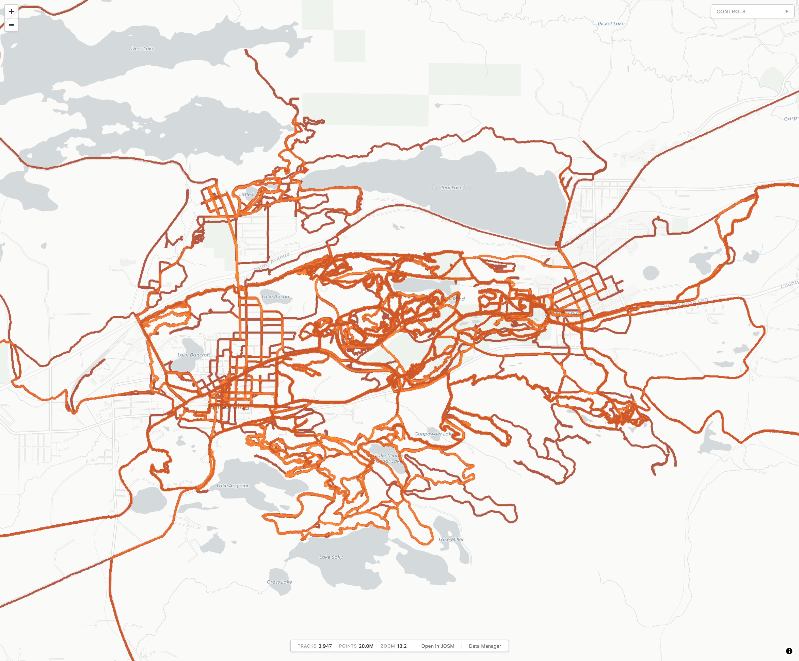
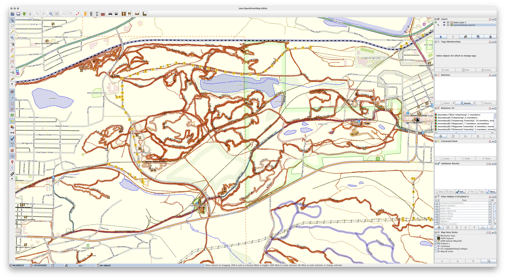

# Local Heatmap Tile Server v1

A self-hosted, Docker-based system that imports GPS activity files and generates heatmap XYZ tiles for use with [MapLibre GL JS](https://maplibre.org/projects/gl-js/), [Leaflet](https://leafletjs.com/), [JOSM](https://josm.openstreetmap.de), and many other map clients.

## Note about AI Development

Almost the entirity of this project (but not this paragraph) was built using [Claude](https://claude.ai) to both quickly scratch an itch and to become more comfortable and familiar with AI-assisted development, with a significant amount of manual bug testing and iterating through features. This tile server is something I've wanted for a while

## Tile Server Features

- **Multi-format import**: Supports `.fit`, `.gpx`, and `.tcx` files from Garmin, Wahoo, Karoo, and other devices. Supports GPX files which contain multiple tracks, such as those exported from [rubiTrack](https://www.rubitrack.com/).
- **Large imports**: Capable of importing a large number of files, or tracks, at once. Tested to import 4000+ .FIT files at once, and a single .GPX (exported from rubiTrack) containing ~4000 tracks.
- **Three heatmap styles**: Warm (orange/red), Cool (blue), and Top 10% (lime green overlay highlighting most-used routes).
- **XYZ tile server**: Standard `/{style}/{z}/{x}/{y}.png` URLs compatible with any tile client.
- **PMTiles export**: Package tiles into a single PMTiles file for static hosting or sharing. (See [PMTiles Viewer](#additional-tools) for a useful stand-alone viewer.)
- **Incremental updates**: Only tiles affected by new data are re-rendered.
- **Duplicate detection**: Two-layer deduplication prevents re-importing the same data (see [Deduplication](#deduplication)).
- **nginx static serving**: Pre-rendered tiles served directly from disk by nginx for fast loading.

## Live Heatmap Viewer Features

- **MapLibre GL JS viewer**: Built-in WebGL map with automatic light/dark mode, smooth fractional zoom, basemap selection, and bookmarkable URLs.
- **Editor integration**: *Use in Editor* menu to open the heatmap as a background layer in [JOSM](https:josm.openstreetmap.de) or [iD](https://www.openstreetmap.org/edit?editor=id), or copy the TMS URL.
- **GPX overlay**: Drag-and-drop GPX files onto the map viewer to compare routes against the heatmap. (See [GPX Overlay](#gpx-overlay).)
- **Data Manager**: Live pre-render progress, file upload, and import/rebuild/export controls.

## Screenshots


*Built-in viewer in Firefox, warm style, light mode.*


*Warm heatmap tiles displayed as an imagery layer in JOSM.*

## Import / Tile Rendering Workflow

1. Upload files via the Data Manager UI, or copy them into `./data/import/`.
2. If copied to the import directory, trigger a scan via the Data Manager or: `curl -X POST http://localhost:8000/api/scan`.
3. Each file is parsed according to its format:
   - **FIT/TCX**: Parsed directly, one track per file.
   - **GPX**: Streamed through a chunked parser that extracts `<trk>` blocks one at a time, supporting multi-GB files with thousands of tracks without excessive memory use. Malformed XML is automatically sanitized (see [GPX Sanitization](#gpx-sanitization)). If a track still fails to parse, it is skipped with a warning and the remaining tracks continue importing.
4. Each track is checked for duplicates (see [Deduplication](#deduplication)) and stored in SQLite.
5. Affected tiles are marked dirty, and stale cached tile files are deleted from disk so nginx serves fresh renders on the next request.
6. Successfully imported files are moved to `./data/import/done/`. Files that fail to parse entirely are moved to `./data/import/errors/`.
7. The background pre-render worker automatically picks up dirty tiles and begins rendering.

## Quick Start / Example

```bash
# Start with docker compose
docker compose up -d --build

# Copy activity files into the import directory
cp ~/garmin-exports/*.fit ./data/import/
cp ~/wahoo-exports/*.gpx ./data/import/
cp ~/rubiTrack-exports/export.gpx ./data/import/

# Trigger an import (or use the Data Manager UI)
curl -X POST http://localhost:8000/api/scan

# At this point data will begin importing and tiles will begin rendering.

# Open the viewer
open http://localhost:8000/

# Open the Data Manager
open http://localhost:8000/manager
```

## Heatmap Styles

| Style | Description | Usage |
|-------|-------------|-------|
| **Warm** | Orange/red gradient | Base heatmap (default) |
| **Cool** | Blue gradient | Alternative base heatmap |
| **Top 10%** | Lime green, transparent overlay | Toggle on top of warm or cool to highlight most-ridden routes |

The Top 10% layer only shows pixels where track overlap intensity exceeds the 90th percentile. Everything below is fully transparent, so it works as an overlay on either base style.

## Tile URLs

| Style | URL |
|-------|-----|
| Warm (orange/red) | `http://localhost:8000/tiles/warm/{z}/{x}/{y}.png` |
| Cool (blue) | `http://localhost:8000/tiles/cool/{z}/{x}/{y}.png` |
| Top 10% (overlay) | `http://localhost:8000/tiles/top10/{z}/{x}/{y}.png` |

Tiles are rendered at zoom levels 2–18. The viewer smoothly upscales z18 tiles for zoom levels 19–20.

## Using Tiles in Editors

The viewer's "Use in Editor" menu can open the heatmap as a background imagery layer in either JOSM or iD (the currently selected style is used).

### JOSM

Requires JOSM to be running with remote control enabled (enabled by default). The viewer sends the imagery URL to JOSM automatically. To add manually:

- Imagery → Custom Imagery
- URL: `tms:http://localhost:8000/tiles/warm/{z}/{x}/{y}.png`
- Name: `Local Heatmap`
- Min zoom: 2, Max zoom: 18

### iD

Opens the OpenStreetMap iD editor in a new tab with the heatmap as a custom background layer. The tile server includes CORS headers so iD can load tiles from `localhost`.

## API Endpoints

### Tile Serving

| Method | Endpoint | Description |
|--------|----------|-------------|
| `GET` | `/tiles/{style}/{z}/{x}/{y}.png` | Serve a heatmap tile (`style`: `warm`, `cool`, or `top10`) |

### Import

| Method | Endpoint | Description |
|--------|----------|-------------|
| `POST` | `/api/scan` | Scan the import directory for new activity files and import them |
| `POST` | `/api/import` | Upload activity files (.fit, .gpx, .tcx) via multipart form |

### Statistics & Management

| Method | Endpoint | Description |
|--------|----------|-------------|
| `GET` | `/api/stats` | File/track counts, GPS point totals, data bounds |
| `POST` | `/api/rebuild` | Clear all tile caches and queue everything for re-rendering |
| `POST` | `/api/rebuild/{style}` | Clear cache for a specific style and queue for re-rendering |

### Pre-render Worker

| Method | Endpoint | Description |
|--------|----------|-------------|
| `GET` | `/api/prerender/status` | Worker state, batch progress, tiles remaining |
| `POST` | `/api/prerender/pause` | Pause background pre-rendering |
| `POST` | `/api/prerender/resume` | Resume background pre-rendering |

### PMTiles Export

| Method | Endpoint | Description |
|--------|----------|-------------|
| `POST` | `/api/export/pmtiles?style=warm` | Export tiles as a PMTiles archive (default: warm) |
| `GET` | `/export/{filename}` | Download an exported PMTiles file |

### Web UI

| Method | Endpoint | Description |
|--------|----------|-------------|
| `GET` | `/` | MapLibre GL JS map viewer with GPX overlay support |
| `GET` | `/manager` | Data Manager with upload, import, rebuild, and export controls |


## GPX Sanitization

GPX files exported from fitness apps sometimes contain invalid XML that would cause a standard parser to fail. Before parsing each track, the importer automatically sanitizes text elements (`<name>`, `<desc>`, `<cmt>`) to fix common issues:

- **Bare ampersands**: `R&R` → `R&amp;R`, `PB&J` → `PB&amp;J`. The `&` character is special in XML and must be escaped. Existing entities like `&amp;` and `&lt;` are preserved (not double-escaped).
- **Unescaped angle brackets**: `<sigh>` → `&lt;sigh&gt;`, `<angryface>` → `&lt;angryface&gt;`. Casual use of `<` and `>` in descriptions is interpreted as XML tags by the parser. The sanitizer identifies text that looks like invalid tags inside known text elements and escapes it.
- **Namespace preservation**: XML namespace declarations from the root `<gpx>` element (e.g., `xmlns:gpxdata="..."`) are captured and included when parsing each individual track block, so extension elements like `<gpxdata:hr>` and `<gpxdata:cadence>` parse correctly.

Tracks that still fail to parse after sanitization are skipped individually — the remaining tracks in the file continue importing normally. Skipped tracks are logged with the reason:

```
Skipping malformed track #22 in racing.gpx: not well-formed (invalid token): line 2, column 24
```

Tracks with no GPS data (e.g., indoor activities with no `<trkpt>` elements) are also skipped, logged separately from parse errors:

```
biking.gpx: 32 tracks had no GPS data (indoor or no trackpoints)
```

## Deduplication

Import deduplication uses two layers, checked in order:

1. **File hash**: The SHA256 hash of the source file is checked first. This catches re-importing the exact same file. For multi-track GPX files, each track gets a unique hash derived from the file hash and track index.

2. **Content hash**: The GPS points themselves are hashed (SHA256 of all coordinates normalized to 6 decimal places, ~0.11m resolution). This catches the same track appearing in different files — for example, a standalone `ride.gpx` and the same ride inside an aggregate `all_activities.gpx` export from an app like rubiTrack.

Content-based deduplication is conservative by design. Two tracks must have exactly the same number of points, in the same order, at the same coordinates (within 0.11m) to be considered duplicates. GPS jitter alone makes it essentially impossible for two genuinely different activities to produce the same content hash, even when riding the same route on different days. Every failure mode errs on the side of importing — no unique data is ever lost.

Blocked duplicates are counted in the Data Manager's Data Summary card. Individual skips are logged with the matched track name:

```
Skipping content-duplicate: export [Morning Ride].gpx matches existing track morning_ride.gpx
```

## Pre-rendering

After importing, affected tiles are automatically queued for background pre-rendering.
The worker renders tiles in parallel batches, producing all three styles (warm, cool, top10) for each tile.

```bash
# Check pre-render progress
curl -s http://localhost:8000/api/prerender/status

# Force a full re-render of all tiles
curl -X POST http://localhost:8000/api/rebuild
```

## PMTiles Export

Export heatmap tiles as a single PMTiles file for static hosting or sharing:

```bash
# Export a specific style
curl -X POST http://localhost:8000/api/export/pmtiles?style=warm

# Download the exported file
curl -O http://localhost:8000/export/warm.pmtiles
```

See `tools/pmtiles-viewer/` for a standalone viewer and Caddy configuration for hosting the exported files.

## GPX Overlay

The map viewer supports loading GPX files as overlays to compare planned or recorded routes against the heatmap:

- **Drag and drop** a `.gpx` file onto the map or the drop zone in the panel.
- **Click** the "GPX Overlay" area to browse for files.
- Routes are rendered as white lines with a dark outline for visibility over all heatmap styles and basemaps.
- Multiple overlays can be loaded simultaneously; each can be individually removed.
- Files are parsed client-side: nothing is uploaded to the server.

## Configuration

Environment variables (set in `docker-compose.yml`):

| Variable | Default | Description |
|----------|---------|-------------|
| `TILE_MIN_ZOOM` | `2` | Minimum zoom level to render |
| `TILE_MAX_ZOOM` | `18` | Maximum zoom level to render |
| `LINE_WIDTH` | `2.0` | GPS track line width in pixels |
| `TILE_SIZE` | `256` | Tile dimensions in pixels |
| `PRERENDER_BATCH_SIZE` | `50` | Tiles to render per batch |
| `PRERENDER_BATCH_PAUSE` | `0.5` | Seconds to pause between batches |
| `PRERENDER_IDLE_PAUSE` | `5.0` | Seconds to sleep when queue is empty |
| `PRERENDER_WORKERS` | CPU count | Parallel render worker threads |
| `MAX_SEGMENTS_PER_TILE` | `10000` | Max track segments per tile (caps memory on low-zoom tiles) |
| `MAX_POINTS_PER_TILE` | `200000` | Max trackpoints queried per tile |
| `TILE_MEM_CACHE_SIZE` | `2000` | In-memory LRU cache size (number of tiles) |

## Directory Layout

```
./data/
  import/         Place activity files here (.fit, .gpx, .tcx)
    done/         Successfully imported files
    errors/       Files that failed to parse
  db/             SQLite database (heatmap.db)
  tiles/          Rendered tile cache
    warm/         Orange/red heatmap tiles
    cool/         Blue heatmap tiles
    top10/        Top 10% overlay tiles (lime green)
  export/         PMTiles exports
```

## Dependencies

**Server (Docker container):**
- Python 3.12, FastAPI, uvicorn
- Pillow + NumPy (tile rendering)
- fitdecode (FIT file parsing)
- gpxpy (GPX file parsing)
- pmtiles (PMTiles export)
- nginx (static tile serving)
- supervisor (process management)

**Client (loaded from CDN by the browser):**
- [MapLibre GL JS](https://maplibre.org/projects/gl-js/) (WebGL map rendering)
- [toGeoJSON](https://github.com/mapbox/togeojson) (client-side GPX parsing)

## Architecture

The container runs nginx and uvicorn (FastAPI) via supervisord:

- **nginx** (port 8000): Serves pre-rendered tiles directly from disk using `sendfile()`. Falls back to uvicorn for tiles not yet rendered. Proxies all API and UI requests to uvicorn.
- **uvicorn** (port 8001, internal): Handles file imports, on-the-fly tile rendering, the pre-render background worker, and all API endpoints.

# Additional Tools

The `tools/` directory contains utilities that run on the host:

- **`pmtiles-viewer/`**: Standalone MapLibre GL JS viewer and Caddy configuration for hosting exported PMTiles files without the tile server. Uses the native `pmtiles://` protocol for efficient tile loading. See `tools/pmtiles-viewer/README.md` for setup instructions.
- **`reset.sh`**: Completely resets the server: stops the container, removes the image, and deletes all data.
- **`vpl-to-gpx.sh`**: Converts Honda/Acura VPLog (.vpl) GPS files to GPX using GPSBabel.

See `tools/README.md` for details.

## Author

Steve Vigneau / [nuxx.net](https://nuxx.net) / <steve@nuxx.net>

Built with [Claude Code](https://claude.com/claude-code) (Claude Opus 4.6, Anthropic).

## License

[MIT](LICENSE)
